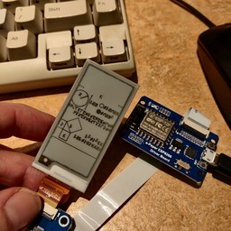
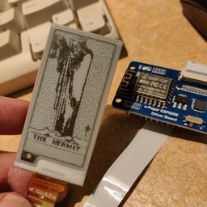

# Celestial Call

 

Celestial Call combines the [Cosmic Call](https://en.wikipedia.org/wiki/Cosmic_Call) "interstellar radio message" images with the [Rider-Waite Tarot Deck](https://en.wikipedia.org/wiki/Rider-Waite_tarot_deck) images, interspersed with one image from each set.  There are 23 images in each set, the Cosmic Call a complete set from the [Dumas-Dutil Message](http://www.plover.com/misc/Dumas-Dutil/messages.pdf) by way of Wikipedia.  The Tarot deck consists of the 22 "Major Arcana," each individual, plus a single card from the 52-card, four-suited deck that form the "Minor Arcana," the Ace of Wands.

Please enjoy views of our scientific attempts to contact extraterrestrial beings alternating with our spiritual ones.  Each of these 46 images presents an archetype: the magician, the Pythagorean theorem, or different views of the human body.

# Parts
## Waveshare e-Paper Module
- Display board WFT0213CZ16-LW, 3C (yellow) display [binary mode]
## ESP8266
- Waveshare e-Paper ESP8266 Driver Board
## Arduino Libraries
- Used WiFi example from  https://github.com/ZinggJM/GxEPD2 and removed un-needed parts.

# Images
- Images served externally
- Display is only It's only 104x212 so can't display 127x127 well
- Tarot images resized to x204
- Scanned by Wikipedia volunteers (see their [copyright](tarot/COPYRIGHT.txt),

## Cosmic Call Images
- Cosmic Call Images from https://pic.blog.plover.com/aliens/dd/dd.zip
- convert ${file}.pbm -monochrome -colors 2 ${file}.bm
- 127x127 pixels native size

## Tarot mages
- Tarot images from Wikipedia https://en.wikipedia.org/wiki/Rider-Waite_tarot_deck
- Processed from original form to 1-bit BMP files with ImageMagick, netpbm, and fmwconcepts.com in [bash](jpgtobmp.sh) [scripts](doit.sh).

## Drawing Library
- Use WiFi example from  https://github.com/ZinggJM/GxEPD2

# Notes
- lots of flickering up/down between images; 3c ones do this, they say.
- used 1b bitmap and turned color flag off and it still does it.
- missing top border for some reason
- Seems not to be a way to tell if the display is done and delay() count seems uncalibrated.
